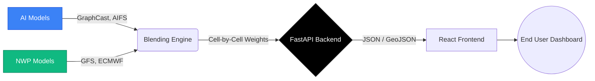

<div align="center">
  
  
  # 🌪️ AtmosFusion
  
  **Hybrid AI–NWP Multi-Model Forecast Blending System**  
  *Built for NCMRWF / Ministry of Earth Sciences (MoES)*

  [](#)
  [](#)
  [](#)
</div>

<br/>

## 🎯 Overview

**AtmosFusion** is an advanced meteorological platform designed to intelligently blend physics-based NWP models (GFS, ECMWF, NCUM, WRF) with state-of-the-art AI weather models (GraphCast, AIFS). Using dynamic cell-by-cell weighting, it provides unparalleled localized forecast accuracy and extreme weather alerts.

---

## ✨ Key Features

| 🛠️ Feature | 📖 Description |
| :--- | :--- |
| 🌍 **Interactive 3D Mapping** | Real-time geospatial visualization using OpenStreetMap & Deck.gl. |
| ⚖️ **Dynamic Blending** | Cell-by-cell consensus weighting for AI and NWP models. |
| 🧠 **Explainable AI (XAI)** | SHAP values to explain dynamic weight assignments per model. |
| 🚨 **Extreme Alerts** | Automated tracking for heavy rainfall and atmospheric anomalies. |

---

## 🏗️ System Architecture



---

## 🚀 Quick Start

The project is structured as a monorepo containing both the **Frontend** and **Backend**.

### 1️⃣ Backend Setup (FastAPI)
```bash
cd backend
python -m venv venv
source venv/bin/activate  # On Windows: venv\Scripts\activate
pip install -r requirements.txt
uvicorn main:app --reload
```
> 📍 **API Docs:** Available at `http://localhost:8000/docs`

### 2️⃣ Frontend Setup (Vite + React)
```bash
cd frontend
npm install
npm run dev
```
> 📍 **Dashboard:** Available at `http://localhost:5173`

---

## ⚙️ Environment Variables

Create a `.env` file inside the `frontend/` directory for maps integration:
```env
VITE_GOOGLE_MAPS_API_KEY=your_google_maps_key_here
```

<br/>

<div align="center">
  <i>Developed with ❤️ for Smart India Hackathon</i>
</div>
