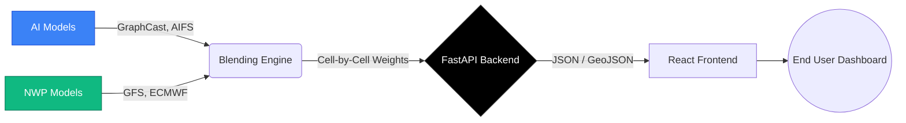

<div align="center">
  
  
  # 🌪️ AtmosFusion
  
  **Hybrid AI–NWP Multi-Model Forecast Blending System**  
  *Built for NCMRWF / Ministry of Earth Sciences (MoES)*

  [](#)
  [](#)
  [](#)

  <br/>
  
  ### 🚀 **[Live Demo: atmosfusion-web.netlify.app](https://atmosfusion-web.netlify.app)**

  <br/>
  
  > *AtmosFusion leverages the power of Artificial Intelligence and numerical physics to deliver highly accurate, localized, and explainable weather forecasts.*
</div>

---

## 🎯 Project Overview

**AtmosFusion** is an advanced meteorological platform designed to bridge the gap between traditional **physics-based NWP models** (like GFS, ECMWF, NCUM, and WRF) and state-of-the-art **AI weather models** (such as GraphCast and AIFS). 

Instead of relying on a single source of truth, the system employs **dynamic cell-by-cell weighting**. It analyzes historical and real-time performance across localized grids to intelligently blend these models, providing unparalleled forecast accuracy and proactive extreme weather alerts.

---

## 💻 Tech Stack

### Frontend Architecture


### Backend Engine


### Mapping & Visualization


---

## ✨ Key Features

| 🛠️ Feature | 📖 Description |
| :--- | :--- |
| 🌍 **Interactive 3D Mapping** | Real-time geospatial visualization using OpenStreetMap & Deck.gl for high-performance rendering. |
| ⚖️ **Dynamic Blending Engine** | Calculates cell-by-cell consensus weighting for AI and NWP models to maximize accuracy. |
| 🧠 **Explainable AI (XAI)** | Features SHAP values and importance graphs to explain exactly *why* certain models were trusted over others. |
| 🚨 **Extreme Weather Alerts** | Automated tracking and threshold notifications for heavy rainfall and atmospheric anomalies. |

---

## 🏗️ System Architecture

The system operates on a decoupled architecture, ensuring that the heavy computational blending process is independent of the client rendering.



---

## 🚀 Quick Start

The project is structured as a monorepo containing both the **Frontend** and **Backend** directories.

### Prerequisites
- Node.js (v18+)
- Python (3.9+)

### 1️⃣ Backend Setup (FastAPI)
```bash
cd backend
python -m venv venv
source venv/bin/activate  # On Windows: venv\Scripts\activate
pip install -r requirements.txt
uvicorn main:app --reload
```
> 📍 **API Docs:** Available at `http://localhost:8000/docs` (Swagger UI)

### 2️⃣ Frontend Setup (Vite + React)
```bash
cd frontend
npm install
npm run dev
```
> 📍 **Dashboard:** Available at `http://localhost:5173`

---

## ⚙️ Environment Variables

Create a `.env` file inside the `frontend/` directory. You will need a Google Maps API Key if you wish to use the Google base map layer.
```env
VITE_GOOGLE_MAPS_API_KEY=your_google_maps_key_here
```

<br/>

<div align="center">
  <i>Developed for Smart India Hackathon</i>
</div>
